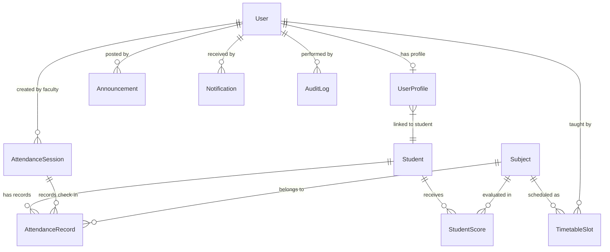

# 🎓 Enterprise Academic Management System (SMS)

> A full-stack, enterprise-grade Academic Management Platform designed with **Django REST Framework**, **MySQL (Aiven Cloud)**, and **React (Vite)**. Built with strict 3-tier Role-Based Access Control (RBAC), student privacy isolation, live expiring QR code attendance, an exact mathematical attendance shortage engine, UGC-compliant SGPA/CGPA performance tracking, server-side paginated queries, and audit logging.

---

## 📑 Table of Contents
1. [Key Features](#-key-features)
2. [Architecture & Design Decisions](#-architecture--design-decisions)
3. [Technology Stack](#-technology-stack)
4. [Role-Based Access Control (RBAC)](#-role-based-access-control-rbac)
5. [Core Engineering Modules](#-core-engineering-modules)
   - [Live Expiring QR Attendance Engine](#1-live-expiring-qr-attendance-engine)
   - [Attendance Shortage Mathematics](#2-attendance-shortage-mathematics)
   - [Academic Performance & UGC SGPA/CGPA Engine](#3-academic-performance--ugc-sgpacgpa-engine)
   - [Soft Deletion Architecture](#4-soft-deletion-architecture)
   - [Audit Trail & Observability](#5-audit-trail--observability)
6. [Database Schema & ER Model](#-database-schema--er-model)
7. [API Documentation (OpenAPI 3 / Swagger)](#-api-documentation-openapi-3--swagger)
8. [Demo Credentials](#-demo-credentials)
9. [Local Setup & Installation](#-local-setup--installation)
10. [Automated Testing Suite](#-automated-testing-suite)
11. [Technical Interview Defense Guide](#-technical-interview-defense-guide)

---

## 🌟 Key Features

- **Zero Fake Data**: Every single metric (SGPA, CGPA, attendance percentages, shortage alerts, timetable slots, announcements, notifications) is computed dynamically from the relational database.
- **3-Tier Role-Based Access Control**:
  - `ADMIN`: User provisioning, department analytics, audit trails, and system-wide configuration.
  - `TEACHER`: QR session broadcasting, live check-in monitoring, manual attendance register, mark entry, and class performance tracking.
  - `STUDENT`: Read-only access to their own academic records, report cards, shortage warnings, timetable, announcements, and live QR check-in modal.
- **Student Data Isolation**: Students are strictly prohibited from viewing other students' attendance records, report cards, or grades (HTTP 403 Forbidden).
- **Expiring QR Code Attendance**:
  - Faculty generates a 30-to-60 second time-based cryptographic token.
  - Live countdown timer and token regeneration.
  - Live attendee check-in polling every 3 seconds.
  - Database-enforced duplicate prevention (`HTTP 409 Conflict`).
- **Mathematical Shortage Engine**:
  - Calculates the exact number of consecutive classes a student must attend to reach the mandatory 75% attendance threshold:
    $$\text{Classes Needed } (x) = \max(0, \lceil 3T - 4P \rceil)$$
- **UGC 10-Point Gradebook Engine**:
  - Real weighted Semester Grade Point Average (SGPA) and Cumulative Grade Point Average (CGPA):
    $$\text{SGPA} = \frac{\sum (\text{Subject Credits} \times \text{Grade Point})}{\sum \text{Subject Credits}}$$
- **Server-Side Pagination & Soft Deletion**:
  - Student directory features server-side search, department filtering, ordering, and pagination ($15$ records/page).
  - Soft-deletion preserves foreign key integrity and historical attendance records while deactivating authentication.
- **Audit Logging**:
  - Tracks administrative actions (create, update, soft-delete, marks modification) with user ID, action type, IP address, and timestamp.

---

## 🏛 Architecture & Design Decisions

```
┌─────────────────────────────────────────────────────────────┐
│                 React Frontend (Vite + SPA)                 │
│  - React Router DOM (v7) with Role-Based Route Guards       │
│  - Context API for Auth State (Admin / Teacher / Student)   │
│  - Axios Interceptors for DRF Token Authentication          │
│  - Real-time Polling for Live QR Check-in Sessions          │
└──────────────────────────────┬──────────────────────────────┘
                               │ JSON over HTTPS (REST)
                               ▼
┌─────────────────────────────────────────────────────────────┐
│               Django REST Framework (Backend)               │
│  ├── accounts       (Custom UserProfile, RBAC permissions)  │
│  ├── students       (Student directory, soft-delete, stats) │
│  ├── attendance     (QR sessions, shortage engine, records) │
│  ├── performance    (Subjects, assessments, SGPA/CGPA math) │
│  ├── timetable      (Weekly schedule per branch & semester) │
│  ├── announcements  (Campus notices filtered by target role)│
│  ├── notifications  (Direct user alerts & unread counters)  │
│  └── audit          (Security audit trail for mutations)    │
└──────────────────────────────┬──────────────────────────────┘
                               │ PyMySQL / SSL (TLS)
                               ▼
┌─────────────────────────────────────────────────────────────┐
│            MySQL Database (Aiven Managed Cloud)             │
│  - InnoDB Engine with Foreign Key Constraints               │
│  - UniqueConstraint on (student_id, session_id)             │
│  - Connection pooling with SSL Certificate verification     │
└─────────────────────────────────────────────────────────────┘
```

### Why a Clean Monolithic Django REST + React Architecture?
- **Interview Clarity**: Eliminates unnecessary complexity (Kafka, Redis, Kubernetes) while demonstrating deep mastery of relational data integrity, concurrency handling, database constraints, and REST API design principles.
- **ACID Compliance**: Relational MySQL transactions guarantee that attendance submissions and mark entries are atomic.
- **Separation of Concerns**: Modular Django apps keep domain logic isolated and maintainable.

---

## 💻 Technology Stack

### Frontend
- **Framework**: React 18 / 19
- **Build Tool**: Vite
- **Routing**: React Router DOM
- **HTTP Client**: Axios with Token Bearer interceptor
- **QR Code Rendering**: `qrcode.react` (SVG/Canvas generation)
- **Styling**: Vanilla CSS (Tailored glassmorphism, responsive grid, dark/light harmonious palette)

### Backend
- **Framework**: Django 6.0 + Django REST Framework (DRF) 3.15+
- **Authentication**: DRF Token Authentication (`rest_framework.authtoken`)
- **API Documentation**: OpenAPI 3.0 via `drf-spectacular` & Swagger UI
- **Database Connector**: `PyMySQL` with SSL (`ca.pem`)
- **CORS**: `django-cors-headers`

### Database
- **Engine**: MySQL 8.x (Hosted on Aiven Cloud)
- **Storage**: InnoDB with ACID transactions and foreign key cascading/protection

---

## 🛡 Role-Based Access Control (RBAC)

The application enforces a 3-tier hierarchy governed by custom DRF permission classes (`Backend/accounts/permissions.py`):

| Role | Permissions & Capabilities |
| :--- | :--- |
| **`ADMIN`** | • Full system administration.<br>• Create / update users and assign roles.<br>• Activate / soft-delete student accounts.<br>• View system-wide analytics and audit trail. |
| **`TEACHER`** | • Create and manage live QR attendance sessions.<br>• Refresh expiring QR tokens and monitor real-time attendee list.<br>• Enter and modify subject assessment marks.<br>• View class performance metrics and attendance registers. |
| **`STUDENT`** | • View personal dashboard, timetable, announcements, and notifications.<br>• Submit live QR attendance token during active sessions.<br>• View personal attendance percentage, shortage breakdown, and classes needed.<br>• View official semester report card (SGPA/CGPA).<br>• **Strictly restricted from viewing other students' data or entering marks.** |

### Object-Level Security & Isolation Check
In addition to view-level permissions, individual detail endpoints enforce student isolation:
```python
profile = getattr(request.user, 'profile', None)
if profile and profile.role == 'student':
    if not profile.student or profile.student.id != student.id:
        return Response(
            {"detail": "You do not have permission to access another student's records."},
            status=status.HTTP_403_FORBIDDEN
        )
```

---

## ⚙ Core Engineering Modules

### 1. Live Expiring QR Attendance Engine
Instead of static QR codes that can be shared or photographed, the system employs **ephemeral session tokens**:
1. **Teacher Generates Session**: Creates an `AttendanceSession` specifying Subject, Date, and Duration (e.g., $45\text{ seconds}$).
2. **Cryptographic Token**: Generates a cryptographically random hex token (`secrets.token_urlsafe(16)`).
3. **Countdown & Expiration**: Token contains an explicit `expires_at` timestamp:
   ```python
   def is_expired(self):
       return timezone.now() > self.expires_at
   ```
4. **Student Check-In**: Student submits the token via mobile/web UI.
5. **Atomic Check & Concurrency**:
   - Validates that `session.is_active is True`.
   - Validates `session.is_expired() is False`.
   - Validates no existing `AttendanceRecord` exists for `(student, session)` (`HTTP 409 Conflict`).
   - Atomically records attendance (`status='Present'`, `marked_via='QR'`).
6. **Live Faculty Dashboard**: Faculty dashboard polls `session-status/` every 3 seconds to display the live roster of verified check-ins.

### 2. Attendance Shortage Mathematics
Most student portals display a static attendance percentage. This platform includes an active **Deficit Resolution Engine**.
If a student's attendance rate falls below the mandatory $75\%$ ($0.75$), the backend solves for $x$ (consecutive classes to attend):

$$\frac{P + x}{T + x} \ge 0.75 \implies P + x \ge \frac{3}{4}(T + x)$$
$$4P + 4x \ge 3T + 3x \implies x \ge 3T - 4P$$
$$\therefore x = \max(0, \lceil 3T - 4P \rceil)$$

Where:
- $T$ = Total classes conducted
- $P$ = Classes attended ($P \le T$)
- $x$ = Minimum consecutive classes required to restore eligibility

### 3. Academic Performance & UGC SGPA/CGPA Engine
Grades and Grade Points are assigned using the standard 10-point UGC scale:
- $\ge 90\% \implies \text{Grade } \mathbf{O} \text{ (Outstanding)}, \text{Point } 10$
- $\ge 80\% \implies \text{Grade } \mathbf{A+} \text{ (Excellent)}, \text{Point } 9$
- $\ge 70\% \implies \text{Grade } \mathbf{A} \text{ (Very Good)}, \text{Point } 8$
- $\ge 60\% \implies \text{Grade } \mathbf{B+} \text{ (Good)}, \text{Point } 7$
- $\ge 50\% \implies \text{Grade } \mathbf{B} \text{ (Above Average)}, \text{Point } 6$
- $\ge 40\% \implies \text{Grade } \mathbf{C} \text{ (Pass)}, \text{Point } 5$
- $< 40\% \implies \text{Grade } \mathbf{F} \text{ (Fail)}, \text{Point } 0$

Weighted Semester Grade Point Average (SGPA):
$$\text{SGPA} = \frac{\sum_{i=1}^{n} (C_i \times GP_i)}{\sum_{i=1}^{n} C_i}$$
Where $C_i$ is the credit weighting of subject $i$, and $GP_i$ is the grade point earned.

### 4. Soft Deletion Architecture
Students are never physically deleted with `DELETE FROM students` to prevent orphaned foreign keys in `AttendanceRecord` and `StudentScore`. Instead:
- Model defines `is_active = models.BooleanField(default=True)`.
- Standard queries filter `.filter(is_active=True)`.
- Administrators can `POST /api/students/{id}/deactivate/` or `POST /api/students/{id}/activate/`.
- Deactivating a student disables their underlying Django `User.is_active`, preventing login immediately.

### 5. Audit Trail & Observability
Mutating actions trigger automated entries in `audit.AuditLog`:
- **Fields**: `user`, `action` (`CREATE`, `UPDATE`, `DELETE`, `MARKS_ENTRY`, `ATTENDANCE_SESSION`), `model_name`, `object_id`, `ip_address`, `details`.
- Visible directly in the **Admin Console** for compliance and fraud detection.

---

## 🗄 Database Schema & ER Model



---

## 📖 API Documentation (OpenAPI 3 / Swagger)

The backend provides interactive documentation generated via `drf-spectacular`:

- **Swagger UI**: `http://localhost:8000/api/docs/`
- **ReDoc UI**: `http://localhost:8000/api/redoc/`
- **Raw OpenAPI 3 YAML/JSON**: `http://localhost:8000/api/schema/`

### Primary API Routes:
| Method | Endpoint | Description | Access |
| :--- | :--- | :--- | :--- |
| `POST` | `/api/auth/login/` | Multi-role user authentication & token generation | Public |
| `GET` | `/api/auth/me/` | Current user profile, role, and student linkage | Authenticated |
| `GET` | `/api/students/` | Paginated student list with search & branch filters | Teacher / Admin |
| `POST` | `/api/students/{id}/deactivate/` | Soft-deletes a student and disables login | Admin |
| `POST` | `/api/attendance/session/create/` | Creates live QR attendance session with token | Teacher / Admin |
| `GET` | `/api/attendance/session/status/` | Polling endpoint for live check-in roster | Teacher / Admin |
| `POST` | `/api/attendance/qr/mark/` | Student submits QR token to record attendance | Student |
| `GET` | `/api/attendance/student/{id}/` | Full attendance summary and shortage math | Self / Staff |
| `GET` | `/api/performance/scores/` | Class-wide student mark entries | Teacher / Admin |
| `POST` | `/api/performance/scores/save/` | Enter / update student internals & end-sem marks | Teacher / Admin |
| `GET` | `/api/performance/student/{id}/` | Authentic student report card and SGPA/CGPA | Self / Staff |
| `GET` | `/api/timetable/` | Weekly schedule filtered by branch & semester | Authenticated |
| `GET` | `/api/announcements/` | Campus notices filtered by user role | Authenticated |
| `GET` | `/api/notifications/` | Direct user notifications with unread count | Authenticated |
| `GET` | `/api/audit/logs/` | Security audit trail of administrative events | Admin |

---

## 🔑 Demo Credentials

| Role | Username | Password | Purpose |
| :--- | :--- | :--- | :--- |
| **System Administrator** | `admin` | `Admin@123` | Full access to users, audit logs, system stats |
| **Faculty / Teacher** | `madam` | `Teacher@123` | QR session generation, mark entry, attendance tracker |
| **Student (CSE)** | `STU001` | `Student@123` | High performer (Aarav Sharma, 9.2 SGPA) |
| **Student (Shortage)** | `STU005` | `Student@123` | Shortage alert case (<75% attendance demonstration) |

---

## 🚀 Local Setup & Installation

### Prerequisites
- Python 3.11+
- Node.js 18+ and npm
- MySQL database (or default Aiven cloud credentials in `.env`)

### 1. Backend Setup
```bash
# Navigate to backend directory
cd Backend

# Create and activate virtual environment
python -m venv venv
# Windows:
.\venv\Scripts\activate
# Linux/macOS:
source venv/bin/activate

# Install dependencies
pip install -r requirements.txt

# Configure environment variables
# Copy .env.example to .env and adjust if using a local MySQL instance:
cp .env.example .env

# Run database migrations
python manage.py migrate

# Seed database with authentic academic records
python seed_database.py

# Start Django development server
python manage.py runserver 8000
```

### 2. Frontend Setup
```bash
# In project root:
cd ..

# Install frontend dependencies
npm install

# Run Vite development server
npm run dev
```

Visit the application at: `http://localhost:5173/`

---

## 🧪 Automated Testing Suite

The backend includes a comprehensive unit test suite covering authentication, RBAC permissions, student isolation, QR attendance workflow, duplicate prevention, shortage math, and SGPA calculations.

Run the test suite:
```bash
cd Backend
.\venv\Scripts\python.exe manage.py test students -v 2
```

### Verified Test Cases:
```text
test_attendance_shortage_calculation ... ok
test_duplicate_attendance_prevented ... ok
test_expired_qr_token_rejected ... ok
test_login_and_token_generation ... ok
test_sgpa_calculation ... ok
test_student_can_mark_attendance_with_token ... ok
test_student_cannot_enter_marks ... ok
test_student_isolation_attendance ... ok
test_student_isolation_performance ... ok
test_student_soft_deletion ... ok
test_teacher_can_create_qr_session ... ok
test_teacher_can_enter_marks ... ok

----------------------------------------------------------------------
Ran 12 tests in 54.000s

OK
```

---

## 🎯 Technical Interview Defense Guide

When asked about this project in technical interviews, use these architectural talking points:

### Q1: "How did you prevent students from sharing QR codes with friends outside the classroom?"
> *"I designed the QR attendance system around **time-delimited, single-use session tokens**. The backend generates an expiring cryptographic token that is valid for only 30–60 seconds. In the frontend, the QR code refreshes dynamically. Furthermore, the database enforces an atomic check and a unique constraint on `(student_id, session_id)`. If a student attempts to scan twice or use an expired token, the API rejects it with HTTP 409 Conflict or HTTP 400 Bad Request."*

### Q2: "How do you protect student privacy between peers?"
> *"I implemented a dual-layer security model. First, view-level permissions verify role authentication via custom DRF permission classes (`IsStudent`, `IsTeacherOrAdmin`). Second, object-level checks in the detail endpoints verify that if the requesting user has the `STUDENT` role, their linked student ID matches the requested resource ID. If they attempt to inspect another student's report card or attendance record, the API immediately halts execution and returns HTTP 403 Forbidden."*

### Q3: "Why did you use soft-delete instead of hard-deleting records?"
> *"Academic records are legally and analytically sensitive. Hard-deleting a student row triggers cascading deletions that erase historical attendance registers and semester grade sheets. Instead, we implemented soft-deletion with an `is_active` boolean flag. Deactivating a student disables their authentication account (`user.is_active = False`) and excludes them from active registers, while preserving historical integrity for auditing."*

### Q4: "How does your shortage calculation work?"
> *"Rather than simply showing that attendance is below 75%, our system calculates the exact number of consecutive classes required to regain eligibility using the formula $x = \max(0, \lceil 3T - 4P \rceil)$, where $T$ is total classes and $P$ is attended classes. This provides actionable academic guidance directly to the student."*

---

## 📄 License
This project is open-source and licensed under the MIT License.
